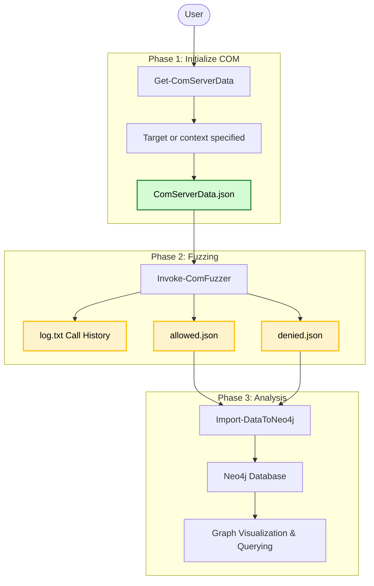

# COM-Fuzzer

After the succes of the [MS-RPC Fuzzer](https://github.com/warpnet/MS-RPC-Fuzzer), I was wondering if the same approach could be applied to COM/DCOM. This involes fuzzing the COM classes and their interface definitions. Gain insights into COM/DCOM implementations that may be vulnerable using an automated approach and make it easy to visualize the data. By following this approach, a security researcher will hopefully identify interesting COM/DCOM classes in such a time, that would take a manual approach significantly more. 

> [!NOTE]
> The owner of this repository is not responsible for any damage of the usage made using these tools. These are for legal purposes only. Use at your own risks.

## Requirements
* [OleViewDotNet](https://github.com/tyranid/oleviewdotnet) PowerShell module
* PowerShell <7 (PS 7 is not supported)

## Install
Clone the repository and import the COM-Fuzzer module:
```powershell
Import-Module .\COM-Fuzzer.psm1
```
If the required PowerShell module `OleViewDotNet` is not installed, you will be asked to install it.

## Quick example
1. Get COM server data for CLSID `13709620-C279-11CE-A49E-444553540000`
```powershell
Get-ComServerData -OutPath .\output\ -CLSID 13709620-C279-11CE-A49E-444553540000
```
2. Execute calculator
```powershell
'.\output\ComServerData.json' | Invoke-ComFuzzer -Procedure ShellExecute -StringInput "calc.exe" -OutPath .\output\
```

For more examples see [Fuzzing examples](/docs/2%20Invoke-ComFuzzer.md).

## Global overview design


## To-do
- Write cypher queries templates for Neo4j
- Implement time out for invoking procedures that take long

## Known bugs
- Find root cause to some PowerShell crashes and fix them

## Acknowledgement
This tool is heavily built upon [OleViewDotNet](https://github.com/tyranid/oleviewdotnet) by [James Forshaw](https://x.com/tiraniddo) with [Google Project Zero](https://googleprojectzero.blogspot.com/). This tool uses the OleViewDotNet module to do most tasks.