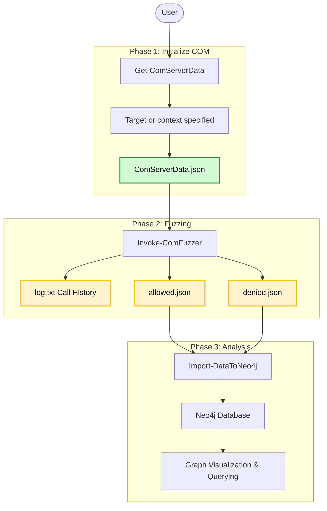

# COM-Fuzzer - documentation

## Phases
First you should meet the [Requirements](../README.md#requirements). Next, I highly suggest you fuzz in a isolated environment. Do not fuzz on your own host since COM/DCOM can break stuff (even from a low privileged user).

### Import Module
First, import the COM-Fuzzer module:
```powershell
Import-Module .\COM-Fuzzer.psm1
```
This loads all cmdlets for both this fuzzer and OleViewDotNet.



### Phase 1: Gather COM interfaces and procedures
First, specify target and get COM interfaces and COM procedures for the target. You can specify a COM CLSID or a `OleViewDotNet.Database.COMRegistryEntry` object (which OleViewDotNet gives you with `Get-ComClass`). This will output a .json file `ComServerData.json`, which you can parse to the fuzzer. If there is not target specified, it will default to building a COM database from the registry.

To speed up fuzzing and have a specific context for which classes you want to fuzz, it is recommended to set the `-ClassContext` argument. Choose from [Remote, Services, Interactive]. If not parsed, all COM interfaces will be fuzzed.

Example:
```powershell
Get-ComServerData -ComDatabaseFile .\com.db -OutPath .\output\ -ClassContext Services
```

For more information on this phase, check [Get-ComServerData](/docs/Get-ComServerData.md)

### Phase 2: Fuzzing

The fuzzer takes the exported JSON file by [Get-ComServerData](/docs/1%20Get-ComServerData.md) as required input.

The fuzzer will output 2 json files and one logfile. It will write the COM calls before invoking them to log.txt, this way if there is a crash (BSOD), you will know which call was responsible (last line)

It will separate the fuzz results into 2 json files:
- Allowed fuzzed inputs
- Fuzzed inputs that lead to Access Denied

For more information on this phase, check [Invoke-ComFuzzer](/docs/2%20Invoke-ComFuzzer.md)

### Phase 3: Analysis
You can use these JSON files for analysis as you like. However, the fuzzer has a option to import them into your Neo4j instance. The fuzzer has a data mapper that makes relations for the data.

For more information on this phase, check [Import-DataToNeo4j](/docs/3%20Import-DataToNeo4j.md).

## Known problemetic COM classes
Some COM interfaces within COM classes cause PowerShell to crash. I have already included some of the procedures in the [Blacklist.txt](/blacklist.txt) file. If you find more, just add them in this file and use the `-Blacklist` argument while fuzzing.

Exclude with:
```powershell
".\output\ComServerdata.json" | Invoke-ComFuzzer -OutPath .\output\ -Blacklist .\blacklist.txt
```