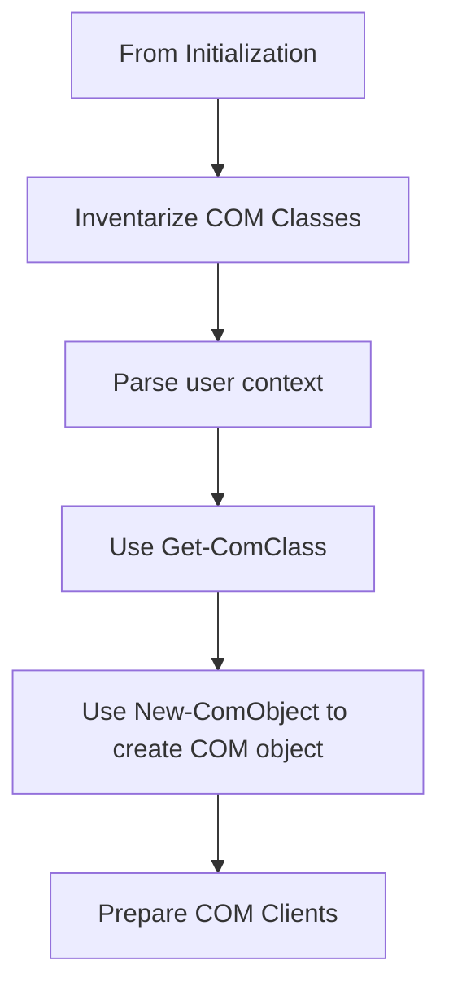

```mermaid
graph TD
    A3[From Initialization] --> B[Inventarize COM Classes]
    B --> B1[Parse user context]
    B1 --> B2[Use Get-ComClass]
    B2 --> B3[Use New-ComObject to create COM object]
    B3 --> C[Prepare COM Clients]
```