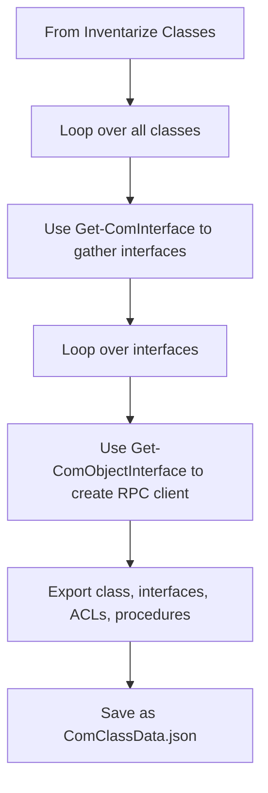

```mermaid
graph TD
    C[From Inventarize Classes] --> C1[Loop over all classes]
    C1 --> C2[Use Get-ComInterface to gather interfaces]
    C2 --> C3[Loop over interfaces]
    C3 --> C4[Use Get-ComObjectInterface to create RPC client]
    C4 --> C5[Export class, interfaces, ACLs, procedures]
    C5 --> C6[Save as ComClassData.json]
```