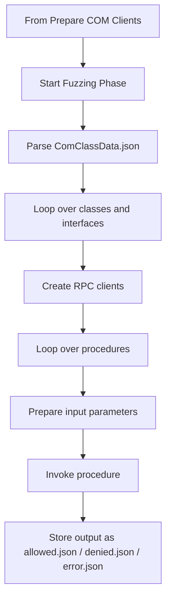

```mermaid
graph TD
    C6[From Prepare COM Clients] --> D[Start Fuzzing Phase]
    D --> D1[Parse ComClassData.json]
    D1 --> D2[Loop over classes and interfaces]
    D2 --> D3[Create RPC clients]
    D3 --> D4[Loop over procedures]
    D4 --> D5[Prepare input parameters]
    D5 --> D6[Invoke procedure]
    D6 --> D7[Store output as allowed.json / denied.json / error.json]
```