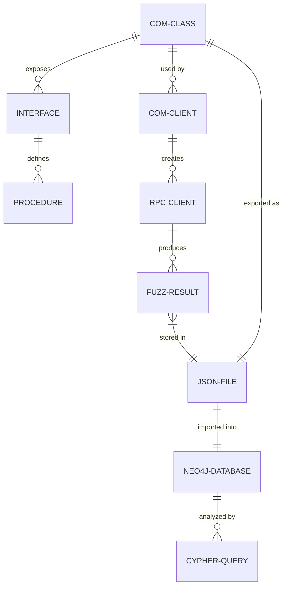

# Entity Relations

```mermaid
erDiagram

    COM-CLASS ||--o{ INTERFACE : "exposes"
    INTERFACE ||--o{ PROCEDURE : "defines"
    COM-CLASS ||--o{ COM-CLIENT : "used by"
    COM-CLIENT ||--o{ RPC-CLIENT : "creates"
    RPC-CLIENT ||--o{ FUZZ-RESULT : "produces"
    FUZZ-RESULT }|--|| JSON-FILE : "stored in"
    COM-CLASS ||--|| JSON-FILE : "exported as"
    JSON-FILE ||--|| NEO4J-DATABASE : "imported into"
    NEO4J-DATABASE ||--o{ CYPHER-QUERY : "analyzed by"
```