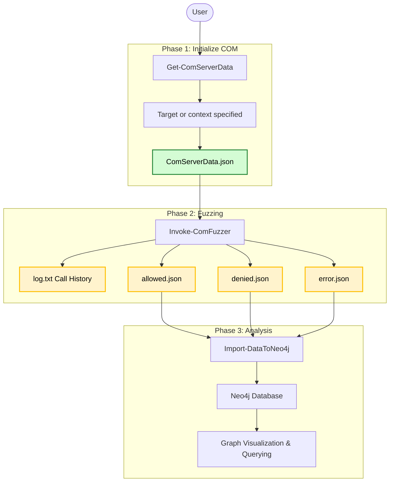

```mermaid
graph TD
    User([User])

    %% Input and output styling
    classDef input fill:#d4fcd4,stroke:#2b8a3e,stroke-width:2px,color:#000;
    classDef output fill:#fff3cd,stroke:#ffbf00,stroke-width:2px,color:#000;

    %% Phase 1: Gather COM Data
    User --> A1[Get-ComServerData]
    A1 --> A2[Target or context specified]
    A2 --> A3[ComServerData.json]
    A3 --> B1[Invoke-ComFuzzer]

    %% Phase 2: Fuzzing
    B1 --> B2[log.txt Call History]
    B1 --> B3[allowed.json]
    B1 --> B4[denied.json]
    B1 --> B5[error.json]

    %% All fuzzer outputs used in Phase 3
    B3 --> C1[Import-DataToNeo4j]
    B4 --> C1
    B5 --> C1

    %% Phase 3: Analysis
    C1 --> C2[Neo4j Database]
    C2 --> C3[Graph Visualization & Querying]

    %% Apply styling
    class A3 input;
    class B3,B4,B5,B2 output;

    %% Labels for clarity
    subgraph Phase1 [Phase 1: Initialize COM]
        A1
        A2
        A3
    end

    subgraph Phase2 [Phase 2: Fuzzing]
        B1
        B2
        B3
        B4
        B5
    end

    subgraph Phase3 [Phase 3: Analysis]
        C1
        C2
        C3
    end
```